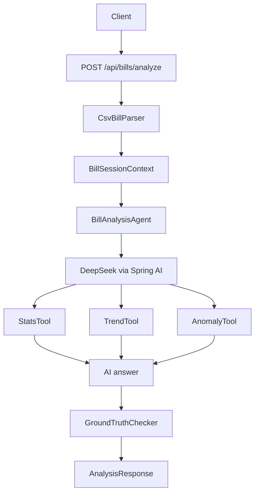

# Bill Analysis Agent

一个基于 Spring Boot、Spring AI 和 DeepSeek 的个人账单分析 Agent 后端项目。它接收 CSV 账单数据和自然语言问题，通过确定性工具计算收支、趋势和异常交易，再让大模型生成可读的财务分析结论。

这个项目的重点不是简单调用大模型，而是演示一种更可靠的 AI 应用模式：让模型负责理解问题和组织答案，让工具负责真实数字计算，并用 guardrail 对模型输出做基础校验。

## Features

- CSV 账单解析：支持 `date,type,amount,category,description` 格式的账单数据。
- 自然语言分析：用户可以直接询问收支、分类、趋势、异常消费等问题。
- Tool-grounded analysis：通过 Spring AI tools 提供确定性计算能力。
- 收支统计：计算总收入、总支出、净余额、收入分类汇总和支出分类汇总。
- 月度趋势：按月份汇总收入、支出和净余额。
- 异常支出检测：结合 Z-score 和中位数规则识别大额异常支出。
- 输出校验：把三个工具的全部结果扁平化成真值集合，逐项比对 AI 答案中的数字，并给出连续的置信度分数（`confidence`）。
- 请求级上下文隔离：使用 request-scoped context，避免不同 HTTP 请求之间的数据串扰，同时记录每次 Agent 实际调用的工具链（`toolsInvoked`）。
- 单元测试覆盖：包含 CSV 解析、统计、异常检测、guardrail 多维度校验测试。
- 端到端评测框架：fixture-driven 评测套件，按数字命中、意图命中、置信度三维度打分，跑 LLM 真实链路并输出汇总报告。

## Tech Stack

- Java 17
- Spring Boot 3.3.5
- Spring AI 1.0.0
- DeepSeek Chat Model
- OpenCSV
- Lombok
- JUnit 5 / AssertJ
- Maven

## Architecture



## Project Structure

```text
src/main/java/com/billanalysis
├── BillAnalysisApplication.java
├── agent
│   ├── BillAnalysisAgent.java
│   ├── BillSessionContext.java
│   └── tools
│       ├── AnomalyTool.java
│       ├── StatsTool.java
│       └── TrendTool.java
├── api
│   ├── AnalysisController.java
│   ├── AnalysisRequest.java
│   ├── AnalysisResponse.java
│   ├── ApiExceptionHandler.java
│   └── ErrorResponse.java
├── guardrail
│   ├── GroundTruthChecker.java
│   └── OutputValidator.java
├── parser
│   ├── BillRecord.java
│   └── CsvBillParser.java
└── prompt
    └── PromptBuilder.java
```

## Input Format

CSV 必须包含以下表头：

```csv
date,type,amount,category,description
```

字段说明：

| Field | Description | Example |
| --- | --- | --- |
| `date` | ISO 日期格式 | `2024-01-05` |
| `type` | 收入或支出 | `INCOME` / `EXPENSE` |
| `amount` | 非负金额 | `15000.00` |
| `category` | 分类 | `Salary`, `Food`, `Rent` |
| `description` | 描述 | `January salary` |

示例数据见 [sample-bills.csv](src/main/resources/sample-bills.csv)。

## Getting Started

### 1. Set DeepSeek API Key

Windows PowerShell:

```powershell
$env:DEEPSEEK_API_KEY="your-deepseek-api-key"
```

macOS / Linux:

```bash
export DEEPSEEK_API_KEY="your-deepseek-api-key"
```

### 2. Run Tests

```bash
mvn test
```

### 3. Start Application

```bash
mvn spring-boot:run
```

默认端口是 `8080`，可在 [application.yml](src/main/resources/application.yml) 中修改。

## API Usage

### Analyze Bills

```http
POST /api/bills/analyze
Content-Type: application/json
```

Request body:

```json
{
  "question": "请分析我的收支情况，并指出是否有异常消费",
  "csvContent": "date,type,amount,category,description\n2024-01-05,INCOME,15000.00,Salary,January salary\n2024-01-08,EXPENSE,3200.00,Rent,January rent\n2024-01-25,EXPENSE,5800.00,Shopping,Winter jacket"
}
```

Response body:

```json
{
  "answer": "AI generated analysis text",
  "groundTruthValid": true,
  "confidence": 1.0,
  "suspiciousFigures": [],
  "toolsInvoked": ["stats", "anomaly"],
  "validationMessage": "Matched 3/3 figures against ground truth",
  "processingTimeMs": 1234
}
```

| Field | Meaning |
| --- | --- |
| `groundTruthValid` | 答案中是否出现"接近但不等于"任何真值的可疑金额 |
| `confidence` | 答案中金额命中真值集合的比例（matched / totalChecked） |
| `suspiciousFigures` | 在真值 ±5% 范围内但未精确匹配的数字列表 |
| `toolsInvoked` | 本次 Agent 实际调用过的工具名（用于意图诊断） |

### Curl Example

```bash
curl -X POST http://localhost:8080/api/bills/analyze \
  -H "Content-Type: application/json" \
  -d '{
    "question": "请总结我的账单，并找出异常支出",
    "csvContent": "date,type,amount,category,description\n2024-01-05,INCOME,15000.00,Salary,January salary\n2024-01-08,EXPENSE,3200.00,Rent,January rent\n2024-01-12,EXPENSE,450.50,Food,Grocery shopping\n2024-01-25,EXPENSE,5800.00,Shopping,Winter jacket"
  }'
```

## Guardrail Design

本项目的 guardrail 不是替代大模型，而是降低大模型在财务数字场景中的幻觉风险。

当前策略（多工具真值集合 + 置信度评分）：

1. **真值收集**：`GroundTruthChecker` 调用全部三个工具（`StatsTool`/`TrendTool`/`AnomalyTool`），把所有确定性金额扁平化进一个 `Set<BigDecimal>`：总收入/支出/净结余、每个 category 汇总、每月 income/expense/net、每条 anomaly amount。统一 `setScale(2, HALF_UP)` 归一化。
2. **数字抽取**：`OutputValidator` 从 AI 答案中正则抽出所有数字。
3. **阈值过滤**：跳过 `abs(n) < 10` 的数字（z-score、月份索引、笔数等非金额）。
4. **逐项比对**：
   - 先 exact match（容差 0.01）→ 命中算 `matched`；
   - 未命中再看是否落在某真值的 ±5% 相对带宽内 → 标记 `suspicious`；
   - 都不命中 → 默默忽略（不算错，也不算对）。
5. **打分**：`confidence = matched / totalChecked`；`valid = suspicious.isEmpty()`。
6. **超大数字防护**：超过 10⁹ 的数字一律视为幻觉，直接返回 `valid=false`。

相比"只比 totalIncome/totalExpense + 硬编码 ±¥500"的早期方案，这套策略覆盖了所有维度的金额、避免了规模相关的魔法值，并且给出一个连续的置信度信号供下游使用（重试、人工审核、UI 标红等）。

## Why This Project Is Useful

这个项目适合作为 AI 应用面试项目，因为它覆盖了几个真实落地问题：

- 如何把非结构化自然语言问题映射到结构化数据分析。
- 如何让 LLM 使用工具，而不是直接编造数字。
- 如何在 AI 输出后增加校验层。
- 如何用 request-scoped context 隔离每次用户请求的数据。
- 如何用测试保护核心计算逻辑。

## Limitations

- 目前只支持请求体中的 CSV 文本，不支持文件上传。
- 分析结果仍是文本为主，没有拆成完全结构化的 `summary/stats/trends/anomalies` 字段。
- 评测 fixture 只有 10 条，覆盖广度有限；扩到 30+ 条才能给出稳定的通过率信号。
- 没有持久化历史账单或用户体系。
- 没有前端页面，当前主要是 API 后端项目。

## Possible Improvements

- 增加 CSV 文件上传接口。
- 将 AI 结果拆成结构化 JSON，方便前端展示。
- 增加数据库持久化和历史分析记录。
- 评测 layer 2：置信度校准（confidence vs 实际正确率分桶），决定下一步该补什么维度的真值。
- 评测 layer 3：LLM-as-Judge 评相关性，补 `GroundTruthChecker` 抓不到的"答非所问"场景。
- 把评测通过率接入 CI（GitHub Actions），作为 PR 门禁。
- 增加 OpenAPI / Swagger 文档。
- 增加 Dockerfile 和 CI workflow。

## Evaluation Harness

除了单元测试，项目还有一套独立的**端到端评测框架**（layer 1），用来量化"换 prompt / 换模型 / 调温度"对实际效果的影响。

### 设计

- **Fixture 集**：`src/test/resources/eval/fixtures.json` 定义一组 `(question, csvFile, expectedNumbers, expectedTools)` 用例，覆盖 5 类意图（总额、类别、月度、异常、多工具混合）。
- **打分维度**：
  - **数字命中**：所有 `expectedNumbers` 是否都出现在答案中（±0.01 容差）；
  - **意图命中**：`expectedTools` 是否都被实际调用（依赖 `BillSessionContext.toolsInvoked`）；
  - **置信度**：直接读 `GroundTruthChecker.confidence`。
- **端到端**：`EvaluationRunner` 用 `@SpringBootTest + MockMvc` 直接打 `/api/bills/analyze`，模拟真实请求路径。
- **opt-in**：标 `@Tag("eval")`，pom.xml 中 surefire 默认 `excludedGroups=eval`，避免普通 `mvn test` 触发 LLM 调用。

### 运行

需要先设置 `DEEPSEEK_API_KEY`，然后：

```powershell
mvn test -Dgroups=eval
```

输出形如：

```
================================================================================================
 Evaluation Report (10 fixtures, 38.5s total)
================================================================================================
 ID                           | Numbers | Tools | Confidence | Elapsed | Pass
------------------------------------------------------------------------------------------------
 q01-total-income             | 1/1     | OK    | 1.00       | 3.2s    | PASS
 q02-total-expense            | 1/1     | OK    | 1.00       | 2.9s    | PASS
 q03-net-balance              | 0/1     | OK    | 0.50       | 3.5s    | FAIL
 ...
------------------------------------------------------------------------------------------------
 Overall: 8/10 passed (80%) | numbers: 8/10 | tools: 10/10 | avg confidence: 0.85
================================================================================================
```

### 扩展 fixture

往 `fixtures.json` 加一条：

```json
{
  "id": "q11-some-new-case",
  "csvFile": "main.csv",
  "question": "二月份房租是多少？",
  "expectedNumbers": [3200],
  "expectedTools": ["trend"],
  "notes": "可选注释，仅给作者看"
}
```

如果需要不同账单数据，把新 CSV 放到 `src/test/resources/eval/csv/` 下，在 `csvFile` 引用即可。

## Test Coverage

当前单元测试覆盖（`mvn test`，不调 LLM）：

- CSV 解析和输入校验
- 收入/支出分类统计
- 异常支出检测
- AI 输出数字提取和超大数字检测
- GroundTruthChecker 多工具真值集合 + 置信度打分

端到端评测（`mvn test -Dgroups=eval`，需 API key）：

- 10 条 fixture 覆盖 5 类意图

运行所有单测：

```bash
mvn test
```
