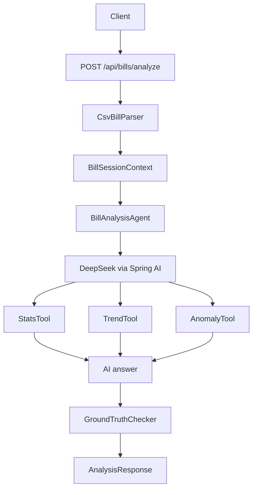

# Bill Analysis Agent

一个基于 Spring Boot、Spring AI 和 DeepSeek 的个人账单分析 Agent 后端项目。它接收 CSV 账单数据和自然语言问题，通过确定性工具计算收支、趋势和异常交易，再让大模型生成可读的财务分析结论。

这个项目的重点不是简单调用大模型，而是演示一种更可靠的 AI 应用模式：让模型负责理解问题和组织答案，让工具负责真实数字计算，并用 guardrail 对模型输出做基础校验。

## Features

- CSV 账单解析：支持 `date,type,amount,category,description` 格式的账单数据。
- 自然语言分析：用户可以直接询问收支、分类、趋势、异常消费等问题。
- Tool-grounded analysis：通过 Spring AI tools 提供确定性计算能力。
- 收支统计：计算总收入、总支出、净余额、收入分类汇总和支出分类汇总。
- 月度趋势：按月份汇总收入、支出和净余额。
- 异常支出检测：结合 Z-score 和中位数规则识别大额异常支出。
- 输出校验：提取 AI 回答中的数字，并和程序计算出的 ground truth 做一致性检查。
- 请求级上下文隔离：使用 request-scoped context，避免不同 HTTP 请求之间的数据串扰。
- 单元测试覆盖：包含 CSV 解析、统计、异常检测和输出校验测试。

## Tech Stack

- Java 17
- Spring Boot 3.3.5
- Spring AI 1.0.0
- DeepSeek Chat Model
- OpenCSV
- Lombok
- JUnit 5 / AssertJ
- Maven

## Architecture



## Project Structure

```text
src/main/java/com/billanalysis
├── BillAnalysisApplication.java
├── agent
│   ├── BillAnalysisAgent.java
│   ├── BillSessionContext.java
│   └── tools
│       ├── AnomalyTool.java
│       ├── StatsTool.java
│       └── TrendTool.java
├── api
│   ├── AnalysisController.java
│   ├── AnalysisRequest.java
│   ├── AnalysisResponse.java
│   ├── ApiExceptionHandler.java
│   └── ErrorResponse.java
├── guardrail
│   ├── GroundTruthChecker.java
│   └── OutputValidator.java
├── parser
│   ├── BillRecord.java
│   └── CsvBillParser.java
└── prompt
    └── PromptBuilder.java
```

## Input Format

CSV 必须包含以下表头：

```csv
date,type,amount,category,description
```

字段说明：

| Field | Description | Example |
| --- | --- | --- |
| `date` | ISO 日期格式 | `2024-01-05` |
| `type` | 收入或支出 | `INCOME` / `EXPENSE` |
| `amount` | 非负金额 | `15000.00` |
| `category` | 分类 | `Salary`, `Food`, `Rent` |
| `description` | 描述 | `January salary` |

示例数据见 [sample-bills.csv](src/main/resources/sample-bills.csv)。

## Getting Started

### 1. Set DeepSeek API Key

Windows PowerShell:

```powershell
$env:DEEPSEEK_API_KEY="your-deepseek-api-key"
```

macOS / Linux:

```bash
export DEEPSEEK_API_KEY="your-deepseek-api-key"
```

### 2. Run Tests

```bash
mvn test
```

### 3. Start Application

```bash
mvn spring-boot:run
```

默认端口是 `8080`，可在 [application.yml](src/main/resources/application.yml) 中修改。

## API Usage

### Analyze Bills

```http
POST /api/bills/analyze
Content-Type: application/json
```

Request body:

```json
{
  "question": "请分析我的收支情况，并指出是否有异常消费",
  "csvContent": "date,type,amount,category,description\n2024-01-05,INCOME,15000.00,Salary,January salary\n2024-01-08,EXPENSE,3200.00,Rent,January rent\n2024-01-25,EXPENSE,5800.00,Shopping,Winter jacket"
}
```

Response body:

```json
{
  "answer": "AI generated analysis text",
  "groundTruthValid": true,
  "validationMessage": "Ground truth check passed",
  "processingTimeMs": 1234
}
```

### Curl Example

```bash
curl -X POST http://localhost:8080/api/bills/analyze \
  -H "Content-Type: application/json" \
  -d '{
    "question": "请总结我的账单，并找出异常支出",
    "csvContent": "date,type,amount,category,description\n2024-01-05,INCOME,15000.00,Salary,January salary\n2024-01-08,EXPENSE,3200.00,Rent,January rent\n2024-01-12,EXPENSE,450.50,Food,Grocery shopping\n2024-01-25,EXPENSE,5800.00,Shopping,Winter jacket"
  }'
```

## Guardrail Design

本项目的 guardrail 不是替代大模型，而是降低大模型在财务数字场景中的幻觉风险。

当前策略：

- 程序先通过 `StatsTool` 计算真实总收入、总支出和净余额。
- `OutputValidator` 从 AI 输出文本中提取数字。
- `GroundTruthChecker` 检查 AI 输出中是否出现明显不合理的大数字。
- 如果 AI 输出的关键数字和真实计算值接近但不一致，则标记为校验失败。

这是一层轻量级防护，适合演示 AI 应用中“模型输出不能直接信”的工程意识。

## Why This Project Is Useful

这个项目适合作为 AI 应用面试项目，因为它覆盖了几个真实落地问题：

- 如何把非结构化自然语言问题映射到结构化数据分析。
- 如何让 LLM 使用工具，而不是直接编造数字。
- 如何在 AI 输出后增加校验层。
- 如何用 request-scoped context 隔离每次用户请求的数据。
- 如何用测试保护核心计算逻辑。

## Limitations

- 目前只支持请求体中的 CSV 文本，不支持文件上传。
- 分析结果仍是文本为主，没有拆成完全结构化的 `summary/stats/trends/anomalies` 字段。
- guardrail 只覆盖部分关键数字，尚未覆盖所有分类、趋势和异常结论。
- 没有持久化历史账单或用户体系。
- 没有前端页面，当前主要是 API 后端项目。

## Possible Improvements

- 增加 CSV 文件上传接口。
- 将 AI 结果拆成结构化 JSON，方便前端展示。
- 增加数据库持久化和历史分析记录。
- 增加更多 guardrail，例如分类金额、月度趋势和异常交易一致性校验。
- 增加 OpenAPI / Swagger 文档。
- 增加 Dockerfile 和 CI workflow。

## Test Coverage

当前单元测试覆盖：

- CSV 解析和输入校验
- 收入/支出分类统计
- 异常支出检测
- AI 输出数字提取和超大数字检测

运行：

```bash
mvn test
```
